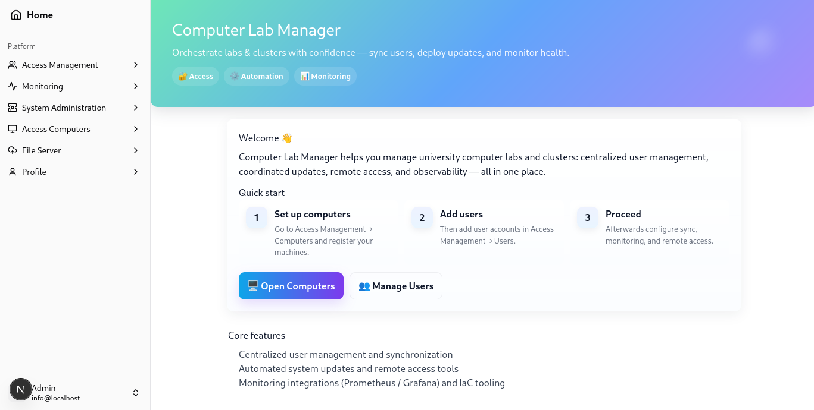

# Computer Lab Manager

## Overview

Computer Lab Manager is an orchestration system designed to manage Linux computer labs and clusters. It solves the practical challenges of maintaining multiple systems while providing centralized control for synchronization, updates, and monitoring, not to mention extra features for users' ease of access!

## 🛠 Core Features

- **Centralized User Management**: Synchronize user accounts
- **Automated System Updates**: Coordinate apt updates with centralized caching
- **Remote Access**: Port forwarding management for computers behind NAT for remote connection
- **Real-time Monitoring**: Monitoring for system health and metrics
- **Configuration Management**: Ansible playbooks for consistent system setup
- **S3 Local Cloud Storage Integration**: Users can upload files using S3-compatible object storage

## 📖 Usage

### Production
* **Clone** this repository. Go to the directory.
* Run `node create-env.js` to setup the environment.
* Run `docker compose up` to start the app. Visit http://localhost

### Development
This is only if you want to work on the code and develop the project.  
* **Clone** this repository. Go to the directory.
* Run `node create-env.js` to setup the environment.
* Run `docker compose up mongo` in project base if you don't have a MongoDB server.
* Install project required node modules by running `npm install`.
* Running `npm run dev:all` will start the app and its services.

## 🔮 Future Roadmap

### Sparkling Integration
Integration with our existing [Sparkling](https://github.com/monajemi-arman/sparkling) project to enable:
- Automated GPU-enabled Spark cluster deployment
- Distributed AI training environment management
- GPU resource allocation and monitoring for machine learning workloads

## 💡 Learning Aspect

*While this project addresses real operational needs, it also serves as a platform for exploring modern DevOps tools and practices that are valuable in today's infrastructure landscape.*

---

*Solving real lab management challenges with modern infrastructure tools*